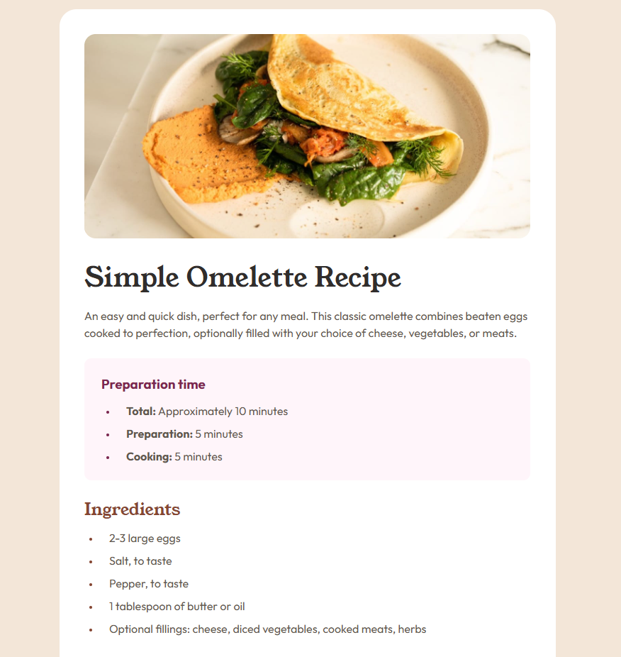

# Frontend Mentor - Results summary component solution

This is a solution to the [Recipe page challenge on Frontend Mentor](https://www.frontendmentor.io/challenges/recipe-page-KiTsR8QQKm). Frontend Mentor challenges help you improve your coding skills by building realistic projects.

## Table of contents

- [Overview](#overview)
  - [The challenge](#the-challenge)
  - [Screenshot](#screenshot)
  - [Links](#links)
- [My process](#my-process)
  - [Built with](#built-with)
- [Author](#author)

## Overview

### The challenge

Users should be able to:

- View the optimal layout for the interface depending on their device's screen size
- See hover and focus states for all interactive elements on the page

### Screenshot

### Links

- Solution URL: (https://github.com/OElmraghy/Recipe-Page)
- Live Site URL: (https://oelmraghy.github.io/Recipe-Page)

## My process

### Built with

- CSS custom properties
- Desktop-first workflow

## Author

- Frontend Mentor - [@OElmraghy](https://www.frontendmentor.io/profile/OElmraghy)
- Twitter - [@OElmraghy](https://www.twitter.com/OElmraghy)
